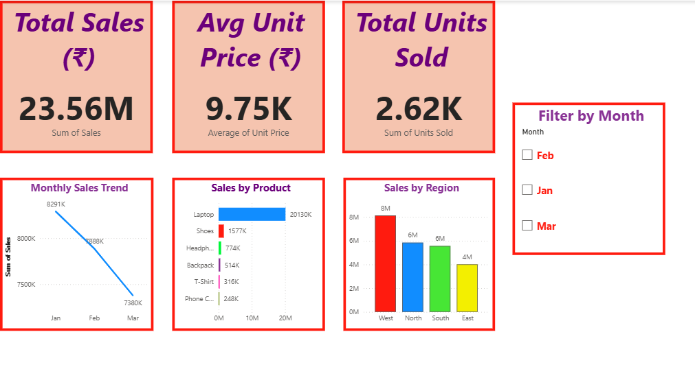
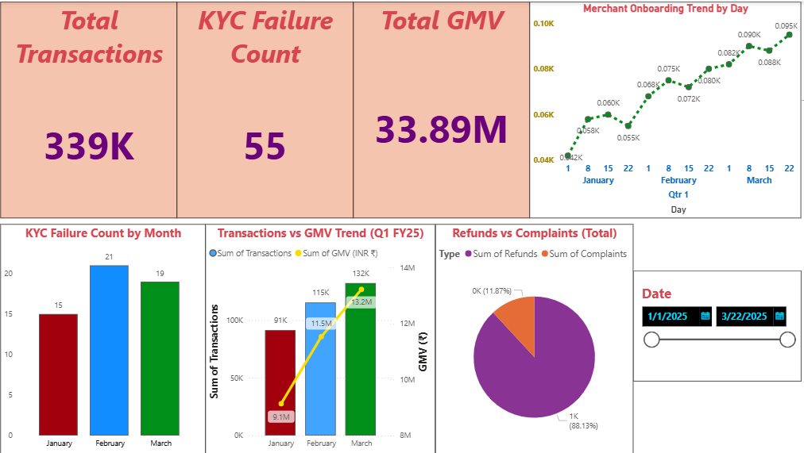
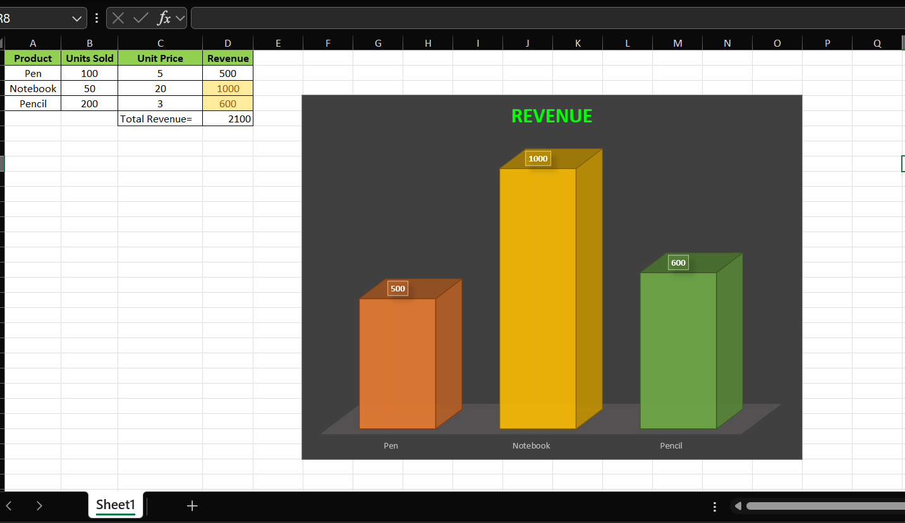
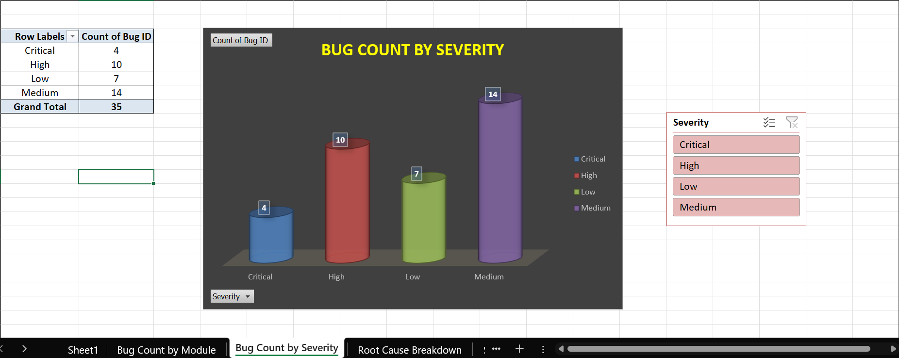
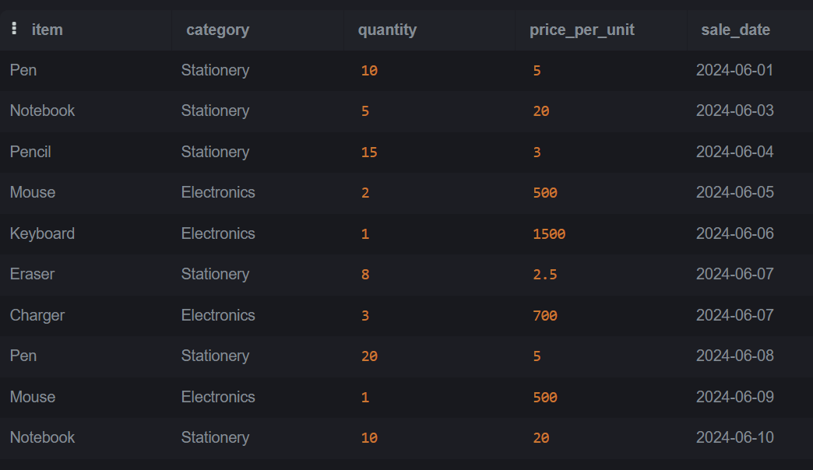

# Suvradeep Portfolio

Hands-on portfolio built with Python, Excel, Power BI, SQL, and QA tools — featuring dashboards, automation scripts, bug reports, and technical communication created as part of a structured career transformation plan.

## 🔹 Python Projects
- **Smart Billing System** →  Item-wise billing logic with discount, GST, and total price calculation using loops and dictionaries.
- **Receipt Generator** → imple Python script that prints itemized purchase summary using formatted strings.
- **Bug Report Formatter** → Formats bug details into clean, shareable reports.
- **CSV Sales Report** → Automated revenue summary using GST & discount from external CSV input.
- **Bug Count Analyzer** → Python script that reads bug data and reports total bugs by module.
- **bug_summary_report.py** → Python-based automation that analyzes bug logs and generates a structured QA report as a text file.
- **bug_summary_report.txt** → Final output summary report generated by the script
- **monthly_sales_data.xlsx** → sample daily sales log (raw input)
- **monthly_sales_summary.py** → script that cleans & summarizes sales data
- **monthly_sales_report.xlsx** → single‑workbook output with cleaned and summary sheets
- **employee_project_data.csv** → Raw dataset of employees, departments, projects, and salaries used for report automation.
- **employee_summary_script.py** → Python script that reads, analyzes, and exports a multi-sheet Excel report from the employee dataset.
- **employee_summary_report.xlsx** → Final structured report showing salaries, top earners, project stats, and department summaries.
- **median_salary_export.py** → Exports median salary by department from a cleaned employee dataset to Excel.
- **employee_sales_data.csv** → Raw sales data used for filtering and sorting tasks.
- **csv_filter_sort.py** → Filters sales > 20 k from employee dataset, sorts by sales, and exports to Excel.
- **filtered_sorted_sales.xlsx** → Resulting file with high‑performing sales employees.
- **expense_data.csv** → Sample personal‑expense dataset used for the tracker script.
- **expense_tracker.py** → Generates monthly and category expense summaries and exports a multi‑sheet Excel report.
- **expense_report.xlsx** → Automated expense report with cleaned data, monthly totals, category totals, and pivot table.
- **attendance_data.csv** → Raw check-in records for employees across dates, used to calculate attendance and absence summaries.
- **attendance_summary.py** → Python script that processes attendance logs, calculates per-employee metrics, and generates a multi-sheet summary report.
- **attendance_report.xlsx** → Final report with cleaned attendance data, days present, absentees, and full-attendance employees — neatly organized into separate sheets.

## 🔹 Excel Dashboards
- **Sales Dashboard** → Tracks revenue by product with auto charts.
- **Smart Billing with Discount + GST** → Calculates item-wise final prices with GST and discount.
- **Bug Summary Dashboard** → Pivot-based Excel report showing bug count by module, severity, and status.
- **bug_report_data** → Clean, structured dataset of 60 QA bugs by platform, severity, and module. Used for Power BI automation and dashboarding.
- **Wi-Fi Bug Dashboard** → Visual analysis of QA issues across modules, severity, and platforms using PivotTables and Excel filters.
- **employee_median_salary.xlsx** → One-sheet Excel report of median salaries by department, generated via Python.
- **employee_kpi_data** → Visual KPIs for project load, satisfaction, deadlines, and training by department using PivotTables and charts.

## 🔹 Power BI Visualizations
- **Revenue by Item Dashboard** → Bar chart visualizing final price with GST for each item, built from Excel data.
- **Bug Reporting Dashboard** – Visualizes 60+ test bugs across modules, platforms, and severity levels to support product and QA decisions.
- **phonepe_ops_dashboard.pbix** — Interactive Power BI report of merchant KPIs (on-boarding, GMV, KYC, refunds).
- **Operations KPI Dataset** → Excel source data feeding the PhonePe dashboard
- **Monthly Sales Dashboard** → Interactive dashboard analyzing Q1 sales by product, region, and month with KPI cards, slicers, and clean visual formatting.
- **median_salary_to_powerbi.pbix** → Simple Power BI visual showing median salary by department from Python-exported Excel.
- **region_product_sales.csv** → Sample transaction dataset (100 rows) used for regional sales KPI and trend analysis.
- **regional_sales_dashboard.pbix** → Interactive dashboard tracking revenue, units sold and transaction count by region, month and product category (Power BI).
- **expense_dashboard.pbix** → Power BI dashboard visualizing monthly expense trends and category breakdown.
- **expense_data.csv** → Sample expense dataset powering the dashboard.

## 🔹 QA & Bug Reporting
- **Mock bug report: Wi-Fi Resume Issue (Intel-style format)** → Portfolio-ready bug report written in industry-standard structure, including logs and reproduction steps.
- **bug_report_email.txt** – Formal bug escalation email for Wi-Fi resume failure. Demonstrates structured QA-to-dev communication and real-world test impact reporting.

## 🔹 SQL
- **sales_analysis_queries** → Initializes a structured sales dataset for query-based analysis and testing.
- **create_sales_schema** → SQL script to define the sales data schema with columns for product, region, price, and date, used across analysis tasks.
- **sales_insight_queries** → 10 interview‑style queries covering GMV, product / region breakdowns, and month‑over‑month growth on the SalesData table.
- **employee_project_data.csv** → Raw dataset used for SQL-based employee and project analysis.
- **Employee Project Analysis** → 10 queries covering salary, headcount, and project KPIs.

## 🔹 ScreenShots
  📸 Project Highlights
| Dashboard / Script | Preview |
|--------------------|---------|
| **Monthly Sales Dashboard (Power BI)** |  |
| **PhonePe Ops KPI Dashboard (Power BI)** |  |
| **Smart Billing System (Python)** |  |
| **Bug Summary Automation (Python)** |  |
| **Sales Dashboard (Excel)** |  |
| **Wi-Fi Bug Dashboard (Excel)** |  |
| **Sales Analysis Queries (SQL)** |  |

